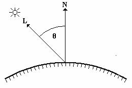

## 光照模型


### 光照模型

#### 测量模型


MERL等实验室使用仪器测量了上百种真实材质表面在不同光照角度和观察角度下的反射数据，并记录在MERL BRDF Database等数据库中。

[MERL BRDF Database]: http://www.merl.com/brdf/


#### 经验模型

- ##### 光照方程

$$
Ilit = Idirect + Iambient
$$

I-direct:直接光分量（I-direct_diffuse:直接光漫反射分量 + I-direct_specular:直接光高光分量）

I-ambient:环境光分量（I-ambient_diffuse:环境光漫反射分量 + I-ambient_specular:环境光高光分量）

- ##### Lambert

$$
Idiffuse = Idirect + Iambient
$$

###### 直接光：

$$
Idirect = Kd * Id * dot(N, L)
$$

Kd(0<Kd<1)：材质对光的反射系数

Id：直接光源强度

L：顶点指向光源的单位向量

N：顶点的单位法向量



###### 环境光：

$$
Iambient = Kd * Ia
$$

Kd(0<Kd<1)：材质对光的反射系数

la：环境光强度

```
//vertex shader
uniform mat4 u_matObjectToWorld;
uniform mat4 u_matWorldToClip;
uniform mat4 u_matObjectToWorldNormal;

attribute vec3 a_position;
attribute vec2 a_texCoord;
attribute vec3 a_normal;

varying vec2 v_texCoord;
varying vec3 v_normal;

void main()
{
	vec4 worldPosition = u_matObjectToWorld * vec4(a_position, 1.0);
	gl_Position = u_matWorldToClip * worldPosition;
	
	v_normal = u_matObjectToWorldNormal * a_normal;
	v_texCoord = v_texCoord;
}

//pixel shader
uniform sampler2D u_texDiffuse;
uniform vec3 u_lightDir;
uniform vec3 u_lightIntensity;

varying vec2 v_texCoord;
varying vec3 v_normal;

void main()
{
	vec4 baseColor = texture2D(u_texDiffuse, v_texCoord);
	gl_FragColor = u_lightIntensity * max(dot(v_normal, u_lightDir), 0.0) * baseColor;
}
```

- ##### Phong

$$
Ispecular = Ks * Id * (dot(V, R))^E
$$

Ks：镜面反射系数

Id：直接光源强度

E：高光指数

V：顶点指向摄像机方向的单位向量

R：反射光的方向

```
//vertex shader
uniform mat4 u_matObjectToWorld;
uniform mat4 u_matWorldToClip;
uniform mat4 u_matObjectToWorldNormal;

uniform vec3 u_lightDir;

attribute vec3 a_position;
attribute vec2 a_texCoord;
attribute vec3 a_normal;

varying vec2 v_texCoord;
varying vec3 v_normal;
varying vec3 v_reflectDir;

void main()
{
	vec4 worldPosition = u_matObjectToWorld * vec4(a_position, 1.0);
	gl_Position = u_matWorldToClip * worldPosition;
	
	v_normal = u_matObjectToWorldNormal * a_normal;
	v_texCoord = v_texCoord;
	v_reflectDir = reflect(u_lightDir, v_normal);
}

//pixel shader
uniform sampler2D u_texDiffuse;
uniform vec3 u_lightIntensity;
uniform vec3 u_viewDir;
uniform float u_specExp;

varying vec2 v_texCoord;
varying vec3 v_normal;
varying vec3 v_reflectDir;

void main()
{
	vec4 baseColor = texture2D(u_texDiffuse, v_texCoord);
	float diffuse = max(dot(v_normal, u_lightDir), 0.0);
	float specular = pow(max(dot(u_viewDir, v_reflectDir), 0.0), u_specExp);
	
	gl_FragColor = (diffuse * baseColor + specular) * u_lightIntensity;
}
```

- ##### Blinn-Phong

$$
Ispecular = Ks * Id * (dot(N, H))^E
$$

Ks：镜面反射系数

Id：直接光源强度

E：高光指数

N：顶点的单位法向量

H：单位半角向量 H =（L+V/|L+V|）

```
//vertex shader
uniform mat4 u_matObjectToWorld;
uniform mat4 u_matWorldToClip;
uniform mat4 u_matObjectToWorldNormal;

attribute vec3 a_position;
attribute vec2 a_texCoord;
attribute vec3 a_normal;

varying vec2 v_texCoord;
varying vec3 v_normal;
varying vec3 v_reflectDir;

void main()
{
	vec4 worldPosition = u_matObjectToWorld * vec4(a_position, 1.0);
	gl_Position = u_matWorldToClip * worldPosition;
	
	v_normal = u_matObjectToWorldNormal * a_normal;
	v_texCoord = v_texCoord;
	v_reflectDir = reflect(u_lightDir, v_normal);
}

//pixel shader
uniform sampler2D u_texDiffuse;
uniform vec3 u_lightIntensity;
uniform vec3 u_viewDir;
uniform vec3 u_lightDir;
uniform float u_specExp;

varying vec2 v_texCoord;
varying vec3 v_normal;
varying vec3 v_reflectDir;

void main()
{
	vec4 baseColor = texture2D(u_texDiffuse, v_texCoord);
	float diffuse = max(dot(v_normal, u_lightDir), 0.0);
	vec3 halfVec = normalize(u_lightDir + u_viewDir);
	float specular = pow(max(dot(v_normal, halfVec), 0.0), u_specExp);
	
	gl_FragColor = (diffuse * baseColor + specular) * u_lightIntensity;
}
```

[返回目录](https://hehanxin.github.io/TA/index)