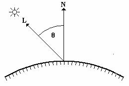

## Lambert

$$
Idiffuse = Idirect + Iambient
$$

###### 直接光：

$$
Idirect = Kd * Id * dot(N, L)
$$

Kd(0<Kd<1)：材质对光的反射系数

Id：直接光源强度

L：顶点指向光源的单位向量

N：顶点的单位法向量



###### 环境光：

$$
Iambient = Kd * Ia
$$

Kd(0<Kd<1)：材质对光的反射系数

la：环境光强度

```
//vertex shader
uniform mat4 u_matObjectToWorld;
uniform mat4 u_matWorldToClip;
uniform mat4 u_matObjectToWorldNormal;

attribute vec3 a_position;
attribute vec2 a_texCoord;
attribute vec3 a_normal;

varying vec2 v_texCoord;
varying vec3 v_normal;

void main()
{
	vec4 worldPosition = u_matObjectToWorld * vec4(a_position, 1.0);
	gl_Position = u_matWorldToClip * worldPosition;
	
	v_normal = u_matObjectToWorldNormal * a_normal;
	v_texCoord = v_texCoord;
}

//pixel shader
uniform sampler2D u_texDiffuse;
uniform vec3 u_lightDir;
uniform vec3 u_lightIntensity;

varying vec2 v_texCoord;
varying vec3 v_normal;

void main()
{
	vec4 baseColor = texture2D(u_texDiffuse, v_texCoord);
	gl_FragColor = u_lightIntensity * max(dot(v_normal, u_lightDir), 0.0) * baseColor;
}
```

[返回目录](https://hehanxin.github.io/TA/index)