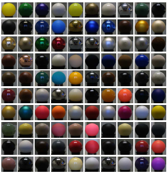

## 光照模型

### 光照模型

#### 测量模型

MERL等实验室使用仪器测量了上百种真实材质表面在不同光照角度和观察角度下的反射数据，并记录在MERL BRDF Database等数据库中。

[MERL BRDF Database]: http://www.merl.com/brdf/

#### 经验模型

- ##### 光照方程

$$
Ilit = Idirect + Iambient
$$

I-direct:直接光分量（I-direct_diffuse:直接光漫反射分量 + I-direct_specular:直接光高光分量）

I-ambient:环境光分量（I-ambient_diffuse:环境光漫反射分量 + I-ambient_specular:环境光高光分量）

[返回目录](https://hehanxin.github.io/TA/index)