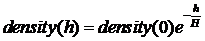
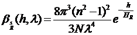

## Procedural Skybox

* 大气散射
  * 参考文章
    * Display of the Earth Taking into account Atmospheric Scattering - 描述了一种模拟天空颜色的算法
    * Display Method of the Sky Color Taking into Account Multiple Scattering - 不完全是关于大气模拟，更多是关于从外太空看到的地球的真实渲染（包括渲染海洋表面、云层和大陆）
    * A Practical Analytic Model for Daylight - 一个分析模型，它提供了对天空颜色的精确模拟，仅适用于位于地面上的观察者
    * A Physically-Based Nightsky Model - 模拟夜空
    
  * 大气模型

    

    * 其中density(0)是海平面的空气密度，h是我们测量大气密度时的高度（海拔高度），H是大气密度均匀时的大气厚度（在科学论文中，H被称为大气标高，大气密度每经过一段距离H其值就减少为原来的值的1/e，H取决于温度）。
    * 大气层由小颗粒（空气分子）组成，小颗粒也会在低空与较大的颗粒混合，称为气溶胶。这些颗粒可以是由风扬起的灰尘或沙子，也可以是因为空气污染而存在的任何颗粒。它们肯定会对大气的外观产生影响，特别是因为它们不像空气分子那样散射光线。空气分子对光的散射称为瑞利散射，气溶胶对光的散射称为米氏散射。

  * 瑞利散射

    * 瑞利散射（空气分子散射光）是造成天空颜色（以及日出和日落的红橙色）的原因

    * 可见光的波长在380到780nm之间变化，440，550和680分别被认为是蓝色、绿色和红色光的波长峰值

    * 瑞利散射系数

      

      * h是高度，λ是波长，N是海平面的分子密度，n是空气的折射率，是大气标高
      * 可见同等情况下，波长越短，散射系数越高
      * 在白天时，具有短波长的蓝光散射得到处都是，因此天空呈现蓝色
      * 在日出和日落时，太阳光需要经过更长的距离才能到观察者的位置，这过程中，波长较短的蓝光被散射，而波长较长的的红、绿光则可以直达观察者的位置，因此地面线位置呈现红黄色，而天空依然呈现蓝色

  * 米氏散射

    * 米氏散射（气溶胶散射光）通常是造成污染城市上方白灰色雾霾的原因，适用于尺寸大于散射波长的粒子，如气溶胶

